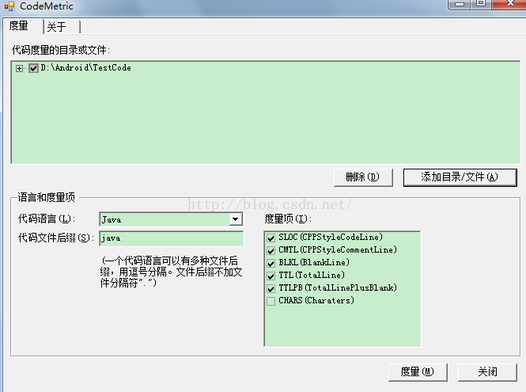
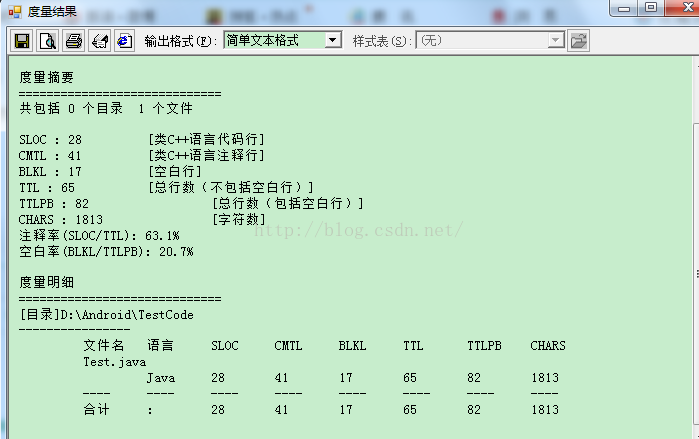
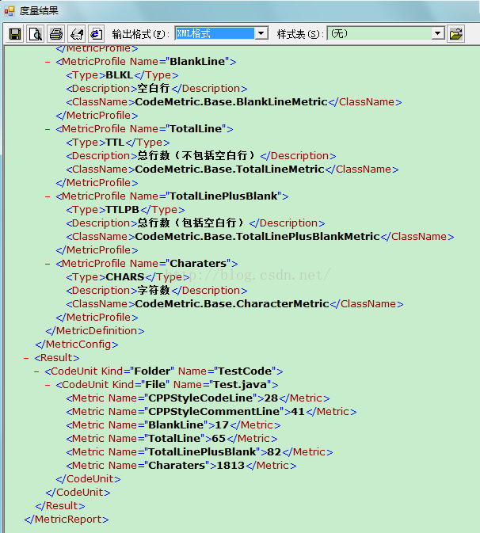
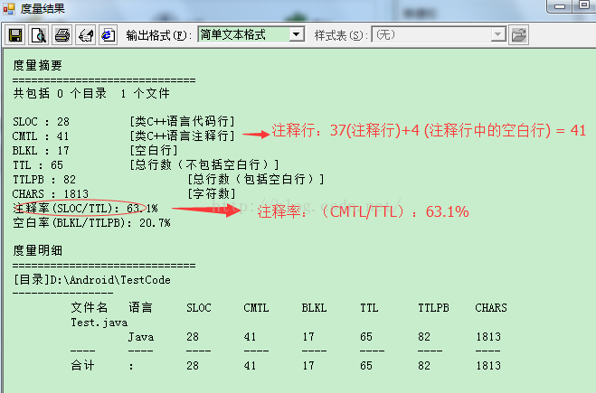
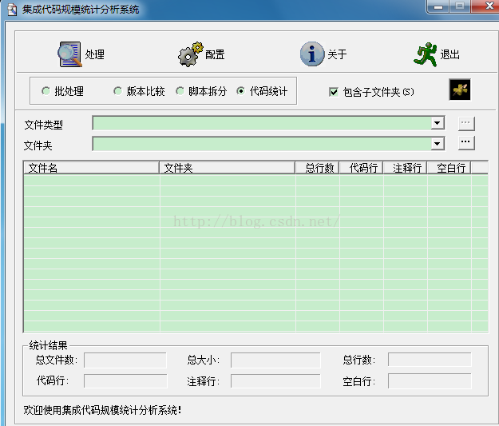
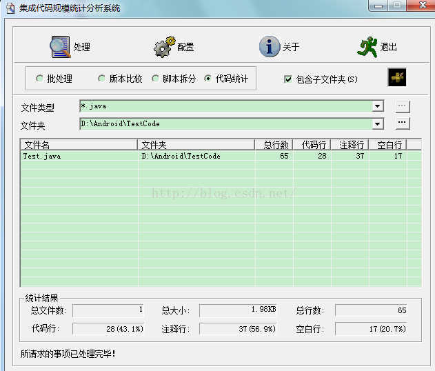
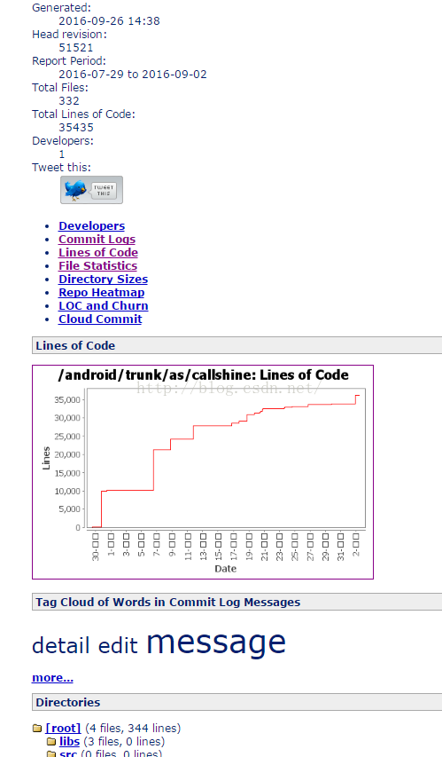
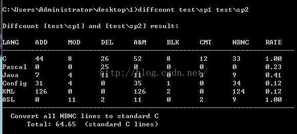
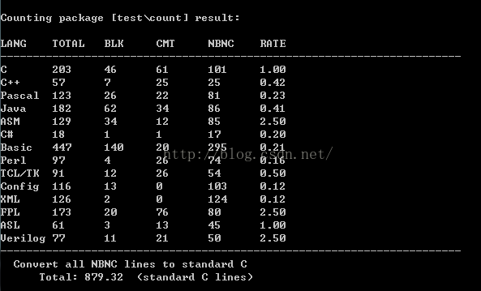

## 1. CodeMetric:
CodeMetric启动后（如下图）

 

### 1.1. 代码统计项：
代码统计主要包括：注释行、空白行、代码行、总行数（不包括空白行）、总行数（包括空白行）、注释率、空白率、字符数。（也就是下图里面的度量项）

### 1.2. 基本操作：
1. 通过点击按钮添加目录/文件添加需要统计的目录/文件。
2. 选择好代码语言类型，代码文件后缀输入框里面的内容，会自动变成选择的代码语言类型默认文件的后缀，也可以自定义添加代码文件后缀。
3. 勾选想要统计的度量项。
4. 点击度量按钮便可以进行统计。

### 1.3. 统计输出格式：
统计输出格式主要分为两种：简单输出格式和XML输出格式。
1. 简单输出格式：


2. XML输出格式：


### 1.4. 实测点评：
对比两种统计输出格式：
1. 简单文本格式：可读性还是比较清晰的。
2. XML格式：可读性一般，看起来比较繁杂一点。

#### 两个细节问题：
1. 注释里面的空白行会计算进去，统计注释行数与实际注释行数有所偏高。
2. 显示细节错误：注释率（SLOC/TTL） ——〉注释率（CMTL/TTL）

    除去上面两个细节问题，整体上来看还算不错，功能比较简单。（如下图）


## 2. ICodeStat:
启动ICodeStat后，可以看到ICodeStat主要有四个功能，分别是：批处理、版本比较、脚本拆分、代码统计。(如下图)


### 2.1. 代码统计项：
代码统计主要包括：注释行、空白行、代码行、总行数（不包括空白行）、总文件数、注释率、空白率。

### 2.2. 基本操作：
1. 通过选择代码统计功能，下面的组合输入框变为文件类型和文件夹，文件类型可以通过输入框选择预先设置好的类型，也可以手工修改和输入，文件夹可以手工输入也可以通过目录选择对话框选择。
2. 选择好文件类型和文件夹后，点击处理就可以开始代码统计工作，通过选择文件类型，可以实现对不同类型的代码进行分别统计的目的。
3. 统计完成后，在下面的统计结果栏中会显示总体的统计结果，在列表框中会保存每个文件的统计结果。

### 2.3. 统计输出格式：
统计输出类似表格的形式，（如下图）

 
### 2.4. 实测点评：
统计输出格式以类似表格的输出方式展现，看起来一目了然。
统计准确，无误差，推荐使用。

## 3. StatSVN：
### 3.1. 相关说明：
StatSVN是一个Java写的开源代码统计程序，从statCVS移植而来，能够从Subversion版本库中取得信息，然后生成描述项目开发的各种表格和图表。比如：代码行数的时间线；针对每个开发者的代码行数；开发者的活跃程度；开发者最近所提交的；文件数量；平均文件大小；最大文件；哪个文件是修改最多次数的；目录大小；带有文件数量和代码行数的Repository tree。StatSVN当前版本能够生成一组包括表格与图表的静态HTML文档。

### 3.2. StatSVN下载
StartSVN官网地址为：http://www.statsvn.org/index.html

StartSVN的下载页面为：http://www.statsvn.org/downloads.html

实测时，官网上最新的版本为：statsvn-0.7.0

### 3.3. StatSVN使用须知
StatSVN的运行需要Java的运行环境支持，所以大家需要安装Java的运行环境（Java Runtime Environment）。JRE可以从Sun的网站上下载。

Statsvn在使用中需要使用SVN的客户端，因此需要确保机器上可以访问到SVN的客户端命令

### 3.4. Checkout工作拷贝
首先从SVN仓库中checkout一个需要统计的路径（如果在工作目录下进行统计，首先请更新，保证工作区中的版本是最新的版本，确保统计结果的准确性），例如我把我的某个路径下的工程checkout在我的电脑上的D:\MyProjects路径下。

### 3.5. 生成svn log文件
首先通过命令行进入工作目录：D:\MyProjects ，再使用svn log -v --xml > logfile.log的命令，其中logfile.log为log文件的名称，可以根据需要自行定义。这样就在工作拷贝的目录下生成一个名称为logfile.log的文件。

注：要在命令行中使用svn命令，在安装TortoiseSVN时必须选择安装commend组件，可以在cmd命令行里输入svn help测试一下该组件是否安装，如果未安装是无法使用svn log命令的。如果能够操作svn server的话也可以直接在服务器上生成svn log然后下载到本地来使用

### 3.6. 调用StatSVN进行统计
首先我们把从官网上下载的statsvn-0.7.0.zip包解压缩到D:\statsvn-0.7.0目录下

通过命令行进入D:\statsvn-0.7.0目录

调用命令：
```java
  java -jar statsvn.jar
```
D:\MyProjects\logfile.log D:\MyProjects，命令运行成功即完成了统计工作。

该命令的格式是:
```java
java -jar statsvn.jar [options] <logfile> <checked-out-module>
```
参数<logfile>为前一步中生成的svn log文件，<checked-out-module>为checkout工作拷贝目录，注意两个参数都要列出正确的全路径，否则会提示错误如logfile.log找不到等等

### 3.7. 基本操作：
1. 先导出svn log
```svn
svn log -v --xml -r Startrevision:Endrevision > svn.log local_project
```
其中Startrevision和Endrevision用来导出一个revision段的svn日志.local_project是svn上的project checkout到本地的结果.

2. 通过statsvn工具做分析
```java
java -jar statsvn.jar svn.log local_project
```
运行完成后,就会在$PWD(unix下)或者%CD%(windows下)下生成对应的分析文件,在index.html文件中就有代码量统计。

### 3.8. 统计输出格式：
输出以html的方式展示统计内容。（如下图）

 
### 3.9. 实测点评：
#### 优点
1. StatSVN会把当前SVN库的状态用图片和图表的方式展现出来，可以按不同分类分别展开，功能强大。
#### 缺点
1. StatSVN统计的是所有代码行，包括注释和空行，但一般度量要求是有效代码行，在分析时需要注意这一点。
2. StatSVN不考虑修改的代码行数，只考虑与上一版本相比新增(+)与删除(-)的代码行数。

> 点评：统计结果以图标的形式表现，功能比较强大，因为统计的内容比较多，个人感觉准确率一般。

## 4. Diffcount
### 4.1. 相关说明：
`diffcount`代码行差异统计工具，用于比较两个代码包的新增，修改，删除的代码量.资源挺好的，统计出来的结果和我自己统计的有些差异。可以统计的文件类型有些少，而且偏后端语言。另外，在windows下使用的时候，直接敲命令行即可。

### 4.2. 主要功能：
1. 差异统计：统计某一个版本的代码包相对于一个原始的基线代码包，变动的代码量，以及变动的代码量中各语言非空非注释行(NBNC)的结果；
2. 代码统计：如果需要，可以把diffcount当作普通的代码行统计工具，统计一个代码包；
`diffcount`命令行方式的编译是直接通过Makefile进行的，目前提供Linux,Cygwin,Windows(MinGW)三种环境下的编译脚本，其他环境中，如果需要编译和使用，请通过修改Makefile文件进行。

`diffcount`的可执行程序名为 `diffcount.exe`

想查询参数信息，请使用 `diffcount --help` 查询帮助
 
`diffcount --cn-help` 可以查询中文帮助， 也可以查看doc下的"命令行参数说明.txt"

### 4.3. 参数说明：
`diffcount`的参数说明：

使用方法:
```java
diffcount [OPTION]... (Baseline) Target
```

功能：对两个代码包进行差异统计、或者对一个代码包进行代码行统计packages 是差异统计的两个对象，也可以是仅作统计的一个对象
```java
  -c --count-only  FILE/DIR
```

仅仅对一个文件或者目录完成统计代码行的功能，没有比较对象，这样Packages参数的数量只能有一个（文件或目录）
```java
   --ignore-case  (DIFF USE ONLY)
```
在比较的时候，忽略文件名的大小写差异(缺省情况会作为两个完全不同的文件）仅在“差异统计”时有效。

> Tips: 一些产品的代码，存在不同的版本的目录和文件的大小写不一样的情况可能是copy或者传送过程中造成的，对于这种情况，请使用该开关。

```java
  --print-lines-info  (DEBUG USE OLY)
```

输出每个文件差异比较后的差异结果和初步统计信息（逐行）,主要用于分析错误

> 注意：不要针对大型代码包使用，否则逐行打印时间消耗惊人
```java
  --print-files-info
```
使用这个开关，当每个文件差异比较和统计以后，输出该文件差异统计的结果信息

缺省不打印每个文件的信息，只打印最后的结果

> Tips: 上边两个开关都需要打印控制台，如果文件较多的话，打印的时间会很长

因此除非有具体分析需要，否则尽量不要打开
```java
  --force-parse-all (DIFF USE ONLY)
```
强制对所有文件进行分析处理（即使它们是完全相同的)，缺省对完全相同的文件略过

仅在“差异统计”时有效，代码行统计(count-only)时所有文件都要处理
```java
  --for-program-reading
```
改变输出方式，以格式化文本形式输出，便于其他程序读取结果信息在由第三方程序调用diffcount，并需要读取统计结果的时候使用，该选项会屏蔽--print-lines-info选项
```java
  -v  --version  
```
输出当前的版本信息
```java
  --help
```
输出帮助信息

### 4.4. 使用方法：
#### 4.4.1. 差异统计

统计某一个版本的代码包相对于一个原始的基线代码包，变动的代码量以及变动的代码量中各语言非空非注释行(NBNC)的结果

`diffcount` 缺省执行的就是差异统计，直接跟上两个代码包的目录即可

在`diffcount`目录下执行：
```java
diffcount test\sp1 test\sp2
```
实际使用中，可能会有文件名和目录名大小写不一致的情况，如果希望忽略文件名大小写的差异，需要使用 --ignore-case参数，否则两个一样的文件，一个会算作删除，一个会算作新增


`ADD MOD DEL A&M BLK CMT NBNC RATE` 的 含义分别为：`新增、修改、删除、新增+修改、空行、注释、非空非注释行、标准C折算率`

#### 4.4.2. 代码统计：

如果需要，可以把`diffcount`当作普通的代码行统计工具，统计一个代码包

代码统计使用 -c (或者--count-only)参数,在diffcount目录下执行
```java
diffcount -c  test\count
```

执行结果如下：

 
### 4.5. 实测点评：

`Diffcount` 主要功能包括代码统计和差异统计，代码统计操作通过命令式方式操作，总体操作还算简单，适合开发者操作，代码统计相对于上面其他三个没特别优势，如果是想用差异统计推荐使用`Diffcount`。


